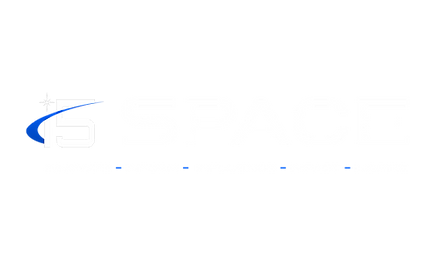
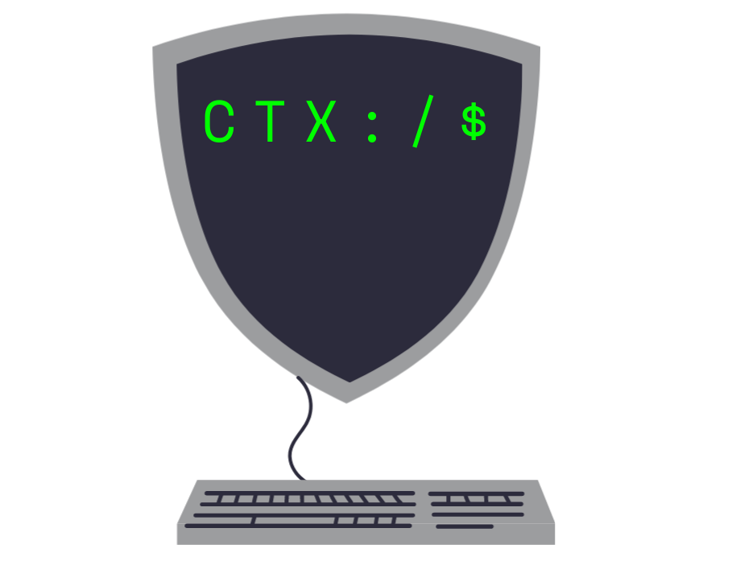

## Welcome to the Cyber Training Exercise (CTX) Github Organization

This Github org contains all the source code for every CTX project.

### Our Vision

Pioneer the future of Space Force cadet training.

### Our Mission

To provide i5 cadets a real, tangible, and engaging view of the 17X career fields and how they operate and interoperate within the Space Force.

### Want to learn more?

See our [Docs](https://github.com/CyberTrainingExercise/Docs/blob/master/readme.md) repo
